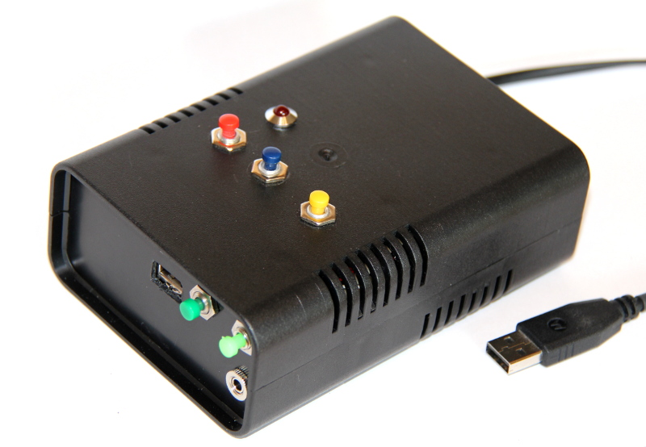
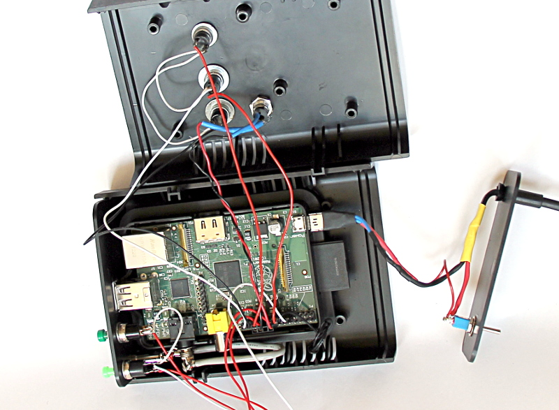
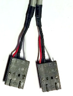

Audiobook Player
=================

Raspberry Pi-based audiobook player with easy to use interface and text-to-speech 
output for book selection.

It is suprisingly difficult to find an easy to use commercial version of a 
player specifically designed to play audio books with the following requirements:

* Very easy to use, in particular for elderly persons with impared eyesight. Tiny displays, 
  tiny buttons, and lots of functions won't work!
* The device should always keep track of the current book and reading position. 
  Turning the device on should automatically continue reading from the last position.
* Skipping forward to a particular chapter in a book ist *not* a requirement.
* Device should be able to store lots of audio books. Selection of a particular book 
  should be as simple as possible.
  
As it seems, a few people had very similar requirements and already built such devices.

For example, there is the http://blogs.fsfe.org/clemens/2012/10/30/the-one-button-audiobook-player[One Button Audiobook Player]. This is a very cool project with a UI as simple as it gets. However, it can only 
handle one single book at a time.

Then there is Willem van der Jagt's https://gist.github.com/wkjagt/814b3f62ea03c7b1a765[BookPlayer],
which has all the required features. For selection of a specific audio book, it uses a
built-in RFID reader. Each book is associated with an RFID tag and reading the tag selects 
the book and starts reading. Although using RFID player is pretty slick, I did not like the
idea of having to deal with a bunch of tags in addition to the player.

I therefore decided to use Willem van der Jagt's design as a basis, but to remove the RFID
feature. Instead, I added a button which allows the user to cycle through the stored books.
Author and title of a selected book are read to the user using a text-to-speach engine.

For maintenance or updating the audio books on the player, I plug a WIFI dongle into an
USB port, which automatically connects to my network. I then use ssh and sftp.

== Hardware

The hardware is pretty straightforward, this is what I used:

* Raspberry Pi (I used a model B Rev. 1 I still had, one of the very earliest ones.)
* SD card. I used one with 8 GB I had lying around, which is good enough for 8-10 books.
* Case. The one I used is called http://www.reichelt.de/Kunststoff-Kleingehaeuse/EUROBOX-SW/3/index.html?&ACTION=3&LA=2&ARTICLE=50429&GROUPID=3355&artnr=EUROBOX+SW[Euro Box] from the local hardware store.
It is a surprisingly good fit. Being able to detach the front and back panels is pretty handy.
* Power switch
* 5 colored push buttons. The ones I used are pretty crappy (and cheap!), but they were the most fitting 
available at the local electronics store.
* LED + socket
* USB cable with micro USB plug on one end. I split the cable and cut the micro USB plug open with a
sharp knife. The rest of the cable was extended and wired up with the power switch. (I think heat shrink tubing
is the most useful stuff ever!)
* 3.5mm audio jack + socket. The socket goes into the front panel and is connected with the jack
which goes into the Raspi's audio socket. To make it fit, the plastic case of the jack was discarded.
* Several old analog floppy audio cables
+

+
They work very well for connecting buttons and LED to the pin header. There are only
three wires per socket, but that can be easily fixed by carefully removing one wire
from another spare socket and inserting it into the empty position.

Since my version of the Raspberry Pi had no mounting holes, I used the bottom part of
a cheap Raspberry Pi case for mounting. The bottom was glued with epoxy to the 
mounting posts of the Euro Box, as can be seen in the picture above.

== Software

Most stuff regarding installation simply follows Willem van der Jagt's 
http://willemvanderjagt.com/2014/08/16/audio-book-reader/[Blog]

For text-to-speech conversion I used Google's 
https://android.googlesource.com/platform/external/svox/[SVOX Pico], which 
provides a much better quality than eSpeak.

I used a precompiled SVOX-Pico http://www.dr-bischoff.de/raspi/pico2wave.deb[Debian package for ARM].

TBD: I will describe details about configuration and installation later.

== Copyright and License

Copyright (C) 2015 Thomas Kern

Licensed under MIT License. See https://raw.githubusercontent.com/nerk/BookPlayer/master/LICENSE.txt[LICENSE] for details.

Based on https://github.com/wkjagt/BookPlayer[BookPlayer],
Copyright (C) Willem van der Jagt.

