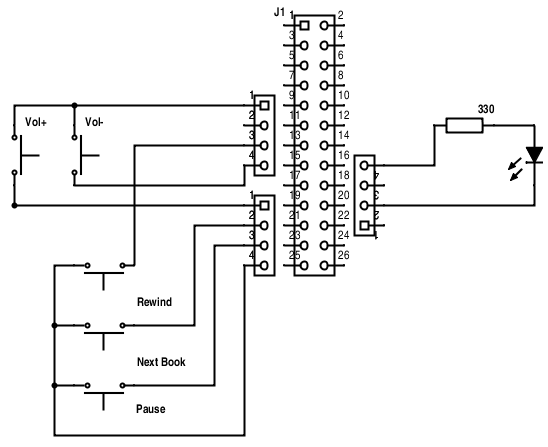

Audiobook Player
=================

Raspberry Pi-based audiobook player with easy to use interface and text-to-speech 
output for book selection.

It is suprisingly difficult to find an easy to use commercial version of a 
player specifically designed to play audio books with the following requirements:

* Very easy to use, in particular for elderly persons with impared eyesight. Tiny displays, 
  tiny buttons, and lots of functions *won't work!*
* The device should always keep track of the current book and reading position. 
  Turning the device on should automatically continue reading from the last position.
* Skipping forward to a particular chapter in a book ist *not* a requirement.
* Device should be able to store lots of audio books. Selection of a particular book 
  should be as simple as possible.
  
As it seems, a few people had very similar requirements and already built such devices.

For example, there is the http://blogs.fsfe.org/clemens/2012/10/30/the-one-button-audiobook-player[One Button Audiobook Player]. This is a very cool project with a UI as simple as it gets. However, it can only 
handle one single book at a time.

Then there is Willem van der Jagt's https://gist.github.com/wkjagt/814b3f62ea03c7b1a765[BookPlayer],
which has all the required features. For selection of a specific audio book, it uses a
built-in RFID reader. Each book is associated with an RFID tag and reading the tag selects 
the book and starts reading. Although using RFID is pretty slick, I did not like the
idea of having to deal with a bunch of tags in addition to the player.

I therefore decided to use Willem van der Jagt's design as a basis, but to remove the RFID
feature. Instead, I added a button which allows the user to cycle through the stored books.
Author and title of a selected book are read to the user using a text-to-speach engine.

For maintenance or updating the audio books on the player, I plug a WIFI dongle into an
USB port, which automatically connects to my network. I then use ssh for mainteance and sftp
for transferring books. On Windows, WinSCP works very well, too.

== Hardware

image::doc/player2.jpg[]

The hardware is pretty straightforward, this is what I used:

* Raspberry Pi (I still had a model B Rev. 1, one of the very earliest ones.)
* SD card. I used one with 8 GB I had lying around, which is good enough for at least 10 books, depending
on the size of the MP3 files.
* Case. The one I used is called http://www.reichelt.de/Kunststoff-Kleingehaeuse/EUROBOX-SW/3/index.html?&ACTION=3&LA=2&ARTICLE=50429&GROUPID=3355&artnr=EUROBOX+SW[Euro Box] from the local electronics store.
It is a surprisingly good fit. Being able to detach the front and back panels is pretty handy in case
I have to use a LAN cable or if I want to remove the SD card.
* Power switch
* 5 colored push buttons. The ones I used are pretty crappy (and cheap!), but they were the most fitting 
available at the local store.
* LED + socket
* USB cable with micro USB plug on one end. I split the cable and cut the micro USB plug open with a
sharp knife. The rest of the cable was extended and wired up with the power switch. (I think heat shrink tubing
is the most useful stuff ever!)
* 3.5mm audio jack + socket. The socket goes into the front panel and is connected with the jack
which goes into the Raspi's audio socket. To make it fit, the plastic case of the jack was discarded.
* Several old analog floppy audio cables
+
image::doc/floppy.jpg[]
+
They work very well for connecting buttons and LED to the pin header. There are only
three wires per plug, but that can be easily fixed by carefully removing one wire
from another spare plug and inserting it into the empty position.

The following picture shows how buttons and LED are wired to the plugs
and the position of the plugs on the pin header.

CAUTION: GPIO numbering changed between board revisions. If your board is Rev. 2 (most likely),
you must make a small change in file config.py!

Since my version of the Raspberry Pi had no mounting holes, I used the bottom part of
a cheap Raspberry Pi case for mounting. The bottom was glued with epoxy to the 
mounting posts of the Euro Box, as can be seen in the picture above.

== Software

Most stuff regarding installation can be found on Willem van der Jagt's 
http://willemvanderjagt.com/2014/08/16/audio-book-reader/[Blog].

Since did a few things differently, I'll try to document the full installation process.

=== Install and Configure Raspbian 

Download https://www.raspberrypi.org/downloads/[Raspian] and install it on your SD card. The card should
be 8GB or greater in order to hold the operating system and a number of books. 

NOTE: The following describes a remote installation because I did not want to bother with 
attaching keyboard and monitor to the Pi.

Connect the Pi to your network with a LAN cable, boot and logon to the Pi via ssh (or putty on Windows)

----
$ ssh pi@raspberrypi
----

Password of user `pi` is `raspberry`.

All of the follwing is done on the Pi.

On first login, you will be greeted with a configuration dialog (which may also be invoked via `sudo raspi-config`). 
Make sure to set `expandfs` to make Rasbian use the whole SD card.

Update your Raspbian:

----
$ sudo apt-get update
----

Force audio through the 3.5 Audio jack:

----
$ sudo amixer cset numid=3 1
----

If you want to use WIFI to access your Pi, it must be configured. I simply used
the https://www.raspberrypi.org/documentation/configuration/wireless/wireless-cli.md[command line].

=== Music Player Daemon (MPD)

The audio player uses the http://www.musicpd.org/[Music Player Daemon] as the backend.

----
$ sudo apt-get install mpd
----

Next, the https://github.com/Mic92/python-mpd2[python-mpd2] client library must be installed. 
I used `pip` for installation, which must be installed first:

----
$ sudo apt-get install python-pip
$ sudo pip install python-mpd2
----

Keeping track of the current book and autoplaying will be controlled by the client frontend. To
avoid potential conflicts, we have to configure MPD to *not* automatically keep track of the current 
book and start autoplaying a book on startup. This is done by editing `/etc/mpd.conf` and
by commenting or deleting the line that starts with

----
state_file ...
----

You may also want to change the `music_directory` parameter
to a directory different from `/var/lib/mpd/music`, for example to a directory under the user's home directory.

=== Text to Speech

For text-to-speech conversion I used Google's 
https://android.googlesource.com/platform/external/svox/[SVOX Pico], which 
provides a much better quality than eSpeak.

I used a precompiled http://www.dr-bischoff.de/raspi/pico2wave.deb[SVOX-Pico Debian package for ARM]
provided by Andreas Bischoff. After downloading, install it with

----
$ sudo apt-get install libpopt-dev
$ sudo dpkg --install pico2wave.deb
----

=== Installation of BookPlayer

Clone this project to the `pi` user's home directory:

----
$ cd
$ git clone https://github.com/nerk/BookPlayer
----

To configure the `sqlite` database, do the following:

----
$ cd BookPlayer
$ sqlite3 state.db

sqlite> .read db.sql
sqlite> .exit
----

=== Autostart on Boot

The player should start automatically when booting the pi and start
playing the current book.

----
$ sudo nano /etc/rc.local
----

After the initial block of comments, add the following line:

----
/home/pi/BookPlayer/start &
----

Save and exit the editor. Make the `start`script executable:

----
chmod 755 /home/pi/BookPlayer/start
----

=== Audiobook Structure

Audiobooks must be put into the MPD `music_directory` folder you configured above. In case you
left it unchanged it defaults to `/var/lib/mpd/music`.

The directory structure for each book is pretty simple and as follows:

----
author name/
   title of the book/
      01-first track.mp3
      02-second track.mp3
      03-third track.mp3
----

For a multi-disc book, the tracks of all CDs must be in a common directory with 
appropriate track numbering, e.g.:

----
author name/
   title of the book/
      101-first track first cd.mp3
      102-second track first cd.mp3
      201-first track second cd.mp3
      202-second track second cd.mp3
----

The player will speak the actual name of the author and the title of the book by reading
the directory names. Each track must start with a unique number in correct order, followed by
a dash with the suffix of `.mp3`. The actual name of the track is arbitrary.

A very convenient way to create this structure is to rip CDs with `abcde`. It will 
also handle multi CD books when used with commandline option `-W`, followed by
the number of the CD:

----
$ abcde -W1
$ abcde -W2
----

== Shortcomings and Improvements

* Parts of the code might not really be thread-safe, should be reviewed.
* The way button presses are handled could be improved. Implementation
  of an event queue might be a way to ensure that no button events are lost.

== Copyright and License

Copyright (C) 2015 Thomas Kern

Licensed under MIT License. See https://raw.githubusercontent.com/nerk/BookPlayer/master/LICENSE.txt[LICENSE] for details.

Based on https://github.com/wkjagt/BookPlayer[BookPlayer],
Copyright (C) Willem van der Jagt.

